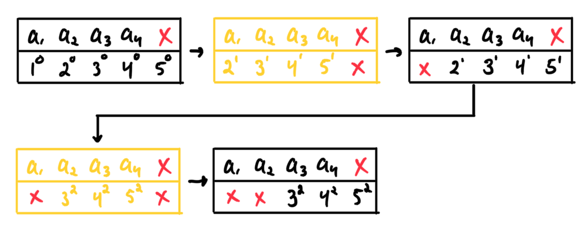

# MuZeroGoJax
MuZero Go implemented with [GoJAX](https://github.com/aigagror/GoJAX).

## Tech Stack

| Tech stack |
| - |
| Training |
| Metrics |
| Losses |
| Game |
| Models |
| GoJax |

## Update step

