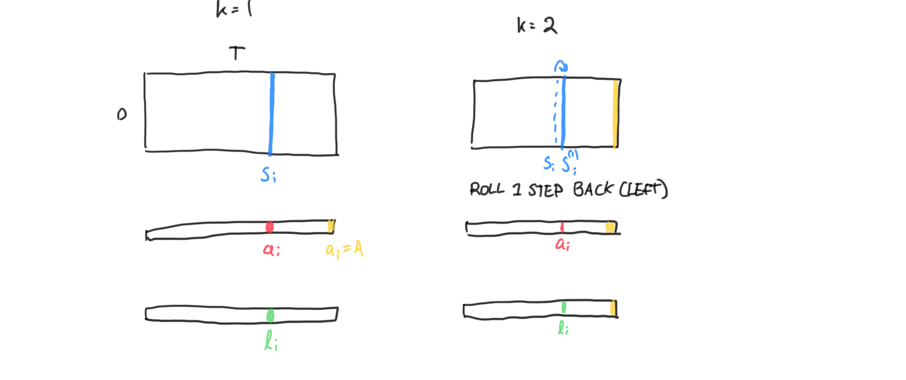

# MuZeroGoJax

Mu Zero Go implemented with [GoJAX](https://github.com/aigagror/GoJAX).

## Update step



## Training configs
#### Simple linear model
* black perspective embedding
* real transition 
* linear value and policy

```shell
--batch_size=2 --board_size=7 --max_num_steps=50 --learning_rate=0.01 \
--training_steps=5 --eval_frequency=0 \
--embed_model=black_perspective --value_model=linear --policy_model=linear \
--transition_model=black_perspective
```

#### Intermediate CNN model
* black perspective + 1-layer CNN embedding
* 1-layer CNN transition 
* linear value and policy

```shell
--batch_size=2 --board_size=7 --max_num_steps=50 --learning_rate=0.01 \
--training_steps=5 --eval_frequency=0 \
--embed_model=black_cnn_lite --value_model=linear --policy_model=cnn_lite \
--transition_model=cnn_lite
```
